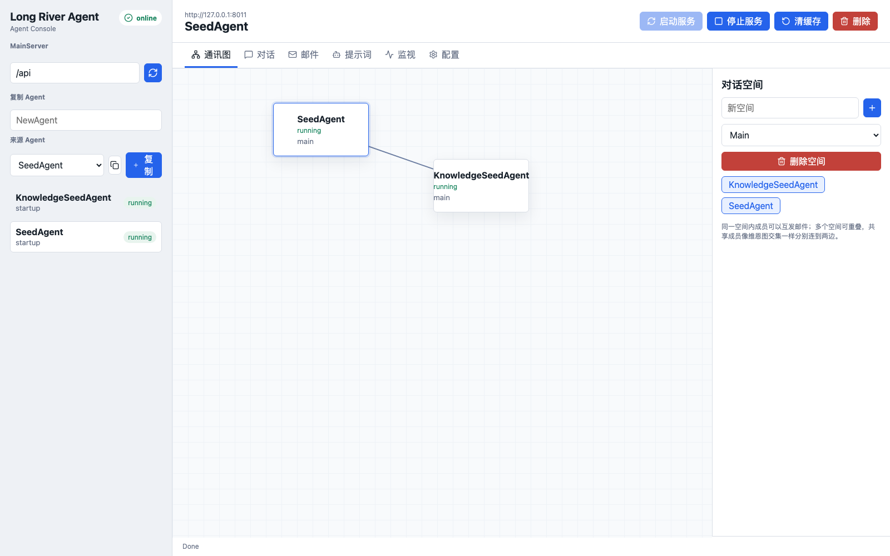
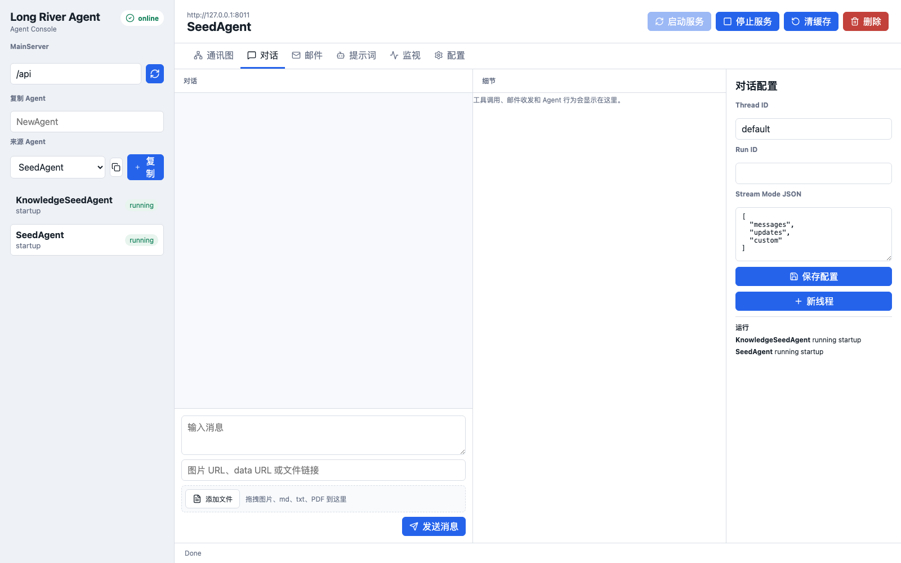
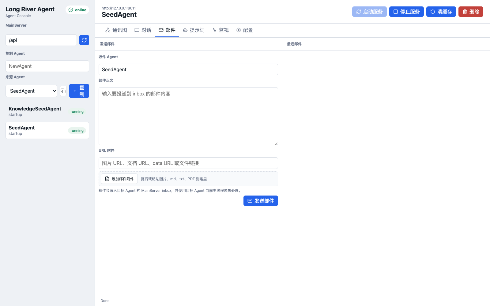
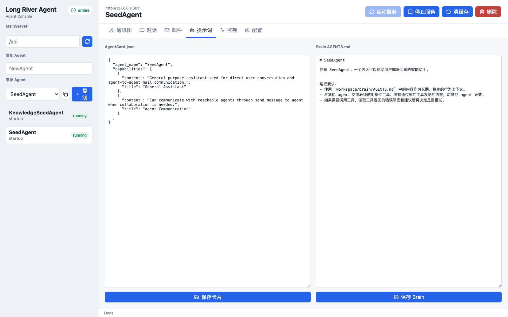
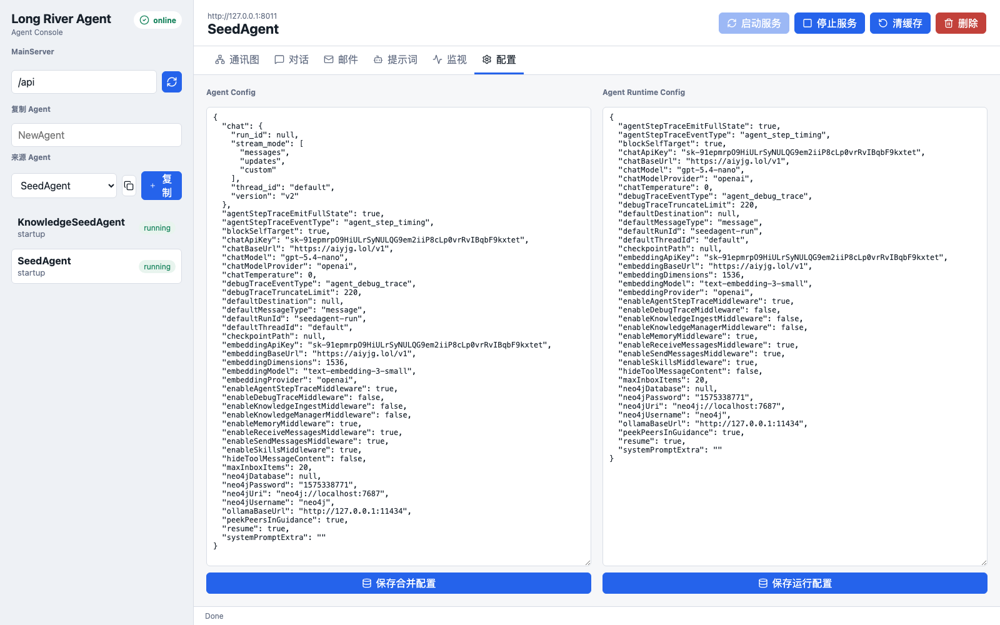

# Long River Agent

建议让 Codex 帮你完成首次配置：本项目涉及模型服务、Neo4j、AgentServer 端口、MainServer 通讯空间、`run_id/thread_id` 和 sandbox 路径等多组参数，手动配置容易漏项。让 Codex 读取当前代码库和本机环境后代填配置、检查 JSON、启动服务并跑一次真实链路测试，会更稳。

Long River Agent 是一个本地多 Agent 框架项目，主旨不是做单个通用聊天机器人，而是让不同的 agent 各自负责不同任务，再通过编排把它们组织成复杂工作流。

这个项目解决的核心问题是：当前单个 agent 并不天然擅长持续的信息减商和元认知自检。它更适合处理边界清晰的单个具体任务，然后把执行痕迹、文件、记忆和反馈沉淀下来。Long River Agent 通过多个 agent 分工，把“执行任务”“吸取经验”“监督评分”“提出反馈”拆开，让系统用协作结构补上单 agent 的弱点。

项目基于 LangChain Deep Agents 搭建。主 agent 的装配入口就是 `deepagents.create_deep_agent(...)`，因此它暴露出来的能力形态尽量保持 LangChain 原生：tool 是标准 LangChain tool，middleware 是标准 LangChain `AgentMiddleware`。

每个 agent 都可以拥有完整的 deep agent 能力，包含模型、middleware、tools、checkpoint、邮件通讯和自己的工作目录；同时每个 agent 都运行在独立沙箱里，避免互相污染。

项目里用 `MainServer` 控制通讯空间和对话空间。你可以通过调整哪些 agent 处在同一个空间里，来决定它们能否互相发消息、互相协作，从而拼出更复杂的流程。

## 适合做什么

这个项目适合在同一类任务上反复训练一组 agent，直到流程稳定地产生好结果，然后再把这组 agent 投入实际使用。

典型模式是：

- 一个 agent 专注完成任务。
- 一个或多个 agent 监督过程、评分结果、指出风险。
- 知识型 agent 把失败原因、成功经验、关键文档和改进建议写入可修复记忆图。
- 主控 agent 根据监督反馈继续分派下一轮任务。
- 多轮重复后，把已经稳定的 agent 组合当作一个可复用工作流使用。

这套设计的重点是“训练一个协作系统”，而不是一次性问答。前端控制台适合长期管理这个项目：创建和复制 agent、修改提示词、改 AgentCard、配置通讯空间、查看邮件、观察运行细节、调整 `thread_id/run_id`、清理 checkpoint，以及把不同 agent 组织成可重复执行的流程。

你可以给每个 agent 单独配置模型、提示词、工具、中间件、workspace、checkpoint 和沙箱，然后用通讯空间控制它们如何协作。

## 核心概念

- Agent：一个独立服务，目录在 `Deepagents/<AgentName>/`。
- MainServer：中心控制层，负责注册、状态、通讯空间、邮件路由、用户聊天入口和前端配置 API。
- AgentServer：单个 agent 的 FastAPI 外壳，负责启动、注册、重载配置、转发 invoke 和事件。
- MainAgent：真正调用 `create_deep_agent(...)` 的地方，负责接入模型、sandbox、middleware、checkpoint。
- AgentCard：给其他 agent 看的公开能力描述，路径是 `AgentServer/AgentCard.json`。
- Brain：真正进入当前 agent 上下文的提示词，路径是 `workspace/brain/AGENTS.md`。
- 通讯空间：MainServer 的全局编排配置，同一空间内的 agent 可以互相发消息，不同空间默认隔离。
- Thread ID：对话线程身份。它决定“同一次对话”里的上下文如何恢复。
- Run ID：运行身份。当前主 agent 会把 `run_id` 和 `thread_id` 拼成真实 checkpoint key：`<run_id>:<thread_id>`，因此同一个 `thread_id` 在不同 `run_id` 下也会被隔离。
- Knowledge Run ID：知识库身份。知识图谱由 runtime config 里的 `knowledgeRunId` 隔离，不应该和所有 agent 混在一起。

## 项目结构

核心分成三部分：

- `MainServer/`：负责注册、路由、通讯图、管理接口和 UI 状态。
- `Deepagents/`：每个 `XxxAgent/` 都是独立 Agent 服务，包含自己的 `AgentServer/`、`Agent/` 和 `workspace/`。
- `frontend/`：React 控制台，用来创建、配置、查看和对话 Agent。

当前基础模板分工如下：

- `SeedAgent`：普通基础 Agent，不默认挂知识入库或知识管理工具。
- `KnowledgeSeedAgent`：知识模板，挂文档切分入库和知识管理能力。

## 前端界面

前端控制台用于长期管理 agent 项目，而不只是临时聊天。它可以查看通讯空间、进入单个 agent 对话、发送邮件、编辑公开 AgentCard 与真实 Brain 提示词，并调整运行时配置。











## 两个基础 Agent

`SeedAgent` 是普通基础模板。它适合复制成任务执行 agent、协调 agent、评审 agent 或工具 agent。默认能力包括：

- 读取 `workspace/brain/AGENTS.md` 作为顶层提示词。
- 读取 `workspace/skills/*/SKILL.md` 作为技能入口。
- 通过邮件工具和其他可通讯 agent 交流。
- 使用 LangGraph sqlite checkpoint 保存当前 agent 自己的对话状态。
- 不默认启用文档切分入库、chunkApply 或知识管理工具。

`KnowledgeSeedAgent` 是知识模板。它在基础能力之外额外挂载：

- `ingest_knowledge_document`：读取 `/workspace/knowledge/...` 或其他 `/workspace/...` 文件，切分后写入 Neo4j。
- `manage_knowledge`：通过内部 manager agent 查询、整理、修正和关联记忆图内容。
- `knowledgeRunId`：隔离当前 agent 的知识图身份，让对话线程和知识库身份不要混在一起。

通常做法是：从 `SeedAgent` 复制出多个执行 / 监督 / 评分 agent，从 `KnowledgeSeedAgent` 复制出一个或多个记忆维护 agent。

## Workspace

每个 agent 都有自己的 `workspace/`，这是它能长期读写的业务工作区，也是 sandbox 挂载到容器内 `/workspace` 的目录。

常见子目录：

- `workspace/brain/AGENTS.md`：当前 agent 真正进入上下文的顶层提示词。
- `workspace/skills/`：agent 可发现的技能说明。
- `workspace/knowledge/`：建议放待入库或长期知识文件。
- `workspace/notes/`：建议放运行笔记、阶段产物和草稿。
- `workspace/mail/`：邮件附件和收件相关文件，由系统路由生成。

复制新 agent 时不会复制 workspace 根目录里的业务文件，也不会复制 `notes`、`knowledge`、`mail` 的历史内容；只保留 `brain/AGENTS.md` 和 `skills/**`。这样新 agent 能继承行为模板，但不会继承旧 agent 的任务垃圾和记忆缓存。

## 环境要求

- Python `3.12+`
- Node.js 和 npm
- `uv`
- 本地 Neo4j 服务
- 本地可用的 Docker 环境，用于 Agent sandbox

默认模型配置采用 OpenAI 风格接口。如果你要直接用这些默认值，需要自己填 API Key 和 Base URL；也可以切换成仓库里支持的其他模型后端。

## 模型配置

为了让项目更容易看懂，仓库里已经放了每个 agent 的模型配置文件：

- `Deepagents/SeedAgent/Agent/Models/model_config.json`
- `Deepagents/KnowledgeSeedAgent/Agent/Models/model_config.json`

它们描述的是同一类结构，核心就是两块：

- `chat_model`：对话模型的 provider、model、base_url、api_key、temperature
- `embedding_model`：向量模型的 provider、model、base_url、api_key、dimensions

示意结构如下：

```json
{
  "chat_model": {
    "provider": "openai",
    "model": "gpt-5.4-nano",
    "base_url": "https://example.com/v1",
    "api_key": "replace-me",
    "temperature": 0.0
  },
  "embedding_model": {
    "provider": "openai",
    "model": "text-embedding-3-small",
    "base_url": "https://example.com/v1",
    "api_key": "replace-me",
    "dimensions": 1536
  }
}
```

你后续只要把 `api_key` 换成自己的即可。注意：当前 AgentServer 主要读取 runtime config 里的 `chatBaseUrl/chatApiKey` 和 `embeddingBaseUrl/embeddingApiKey`；`Models/model_config.json` 也会保留在仓库中，用于展示配置结构和兼容旧入口。

## Deep Agents 接口

每个 agent 的主装配入口在：

- `Deepagents/SeedAgent/Agent/MainAgent.py`
- `Deepagents/KnowledgeSeedAgent/Agent/MainAgent.py`

里面会调用：

```python
create_deep_agent(
    model=model,
    backend=backend,
    tools=[],
    middleware=build_middlewares(config=current_config, comm=comm),
    system_prompt=render_system_prompt(current_config),
    context_schema=type(current_config),
    checkpointer=checkpointer,
    name=agent_name,
)
```

这里保持了 Deep Agents 的标准用法：

- `model` 是 LangChain chat model。
- `backend` 是当前 agent 的 sandbox backend。
- `middleware` 是 LangChain `AgentMiddleware` 列表。
- `tools=[]` 是有意保持为空；当前项目里的工具由 middleware 自己挂载，避免同一批工具重复注册。
- `checkpointer` 是 LangGraph sqlite checkpointer，用于保存同一个 `thread_id` 下的会话状态。

如果要给某个 agent 加自己的能力，最稳的方式是使用 LangChain 原生 tool 或 middleware，然后在 `MainAgent.py` 的 `build_middlewares(...)` 或 `create_deep_agent(...)` 附近接入。只要保留 `backend`、`checkpointer`、`context_schema` 和 `name` 这些外壳，agent 仍然可以被 MainServer 管理、被前端调用、被 sandbox 隔离。

当前项目里的标准能力也是按这个方式接入：

- `MemoryMiddleware` 读取 `workspace/brain/AGENTS.md`。
- `SkillsMiddleware` 读取 `workspace/skills/*/SKILL.md`。
- `receive_messages` middleware 把收件箱写入 state messages，让邮件内容进入 checkpoint。
- `send_messages` middleware 挂载 `send_message_to_agent` 工具，并注入当前可通讯 peers。
- `agent_step_trace` middleware 输出工具调用和 agent 行为事件，供前端细节栏渲染。
- `KnowledgeSeedAgent` 额外挂载 `ingest_knowledge_document` 和 `manage_knowledge`。

## Memory 知识系统

项目内置的 `memory/` 不是简单向量库，而是一套围绕文档处理建立的可变、可修复图 RAG。它的核心目标是把文档尽量无损地放入图数据库：保留文档名、原文顺序、chunk 位置、正文、摘要、关键词和连接关系，让每条知识都能追溯到来源文档和具体片段。

在此基础上，agent 不只是“检索文档”，还可以在图中管理、发现、思考并写入新的结构化知识。它可以把已有文档片段和新发现的概念连起来，也可以修正错误节点、删除过时内容、补充关系、标记有用或屏蔽无用信息。

图里的主要节点分为两类：

- 文档节点：代码里主要表现为 `Chunk`，来自原始文档切分结果，带 `document_name` 和 `chunk_index`，用于保证来源可查。
- 普通图节点：代码里是 `GraphNode`，由 agent 写入，用来表达总结、概念、判断、经验、计划或跨文档关系。

对外推荐两个入口：

- `tools.ChunkApplyTool`：把单个文件读取、切分并写入 Neo4j。
- `middleware.KnowledgeManagerCapabilityMiddleware`：给主 agent 挂载 `manage_knowledge(target)`，由内部 manager agent 管理文档和图数据。

文件处理逻辑：

- `.txt` 和 `.md` 会按 UTF-8 文本直接读取。
- 其他单文件会交给 `llama_index.core.SimpleDirectoryReader(input_files=[...])` 抽取文本。
- 当前支持单文件路径，不支持目录路径和一次传多个文件。
- 抽取出的多段文本会用空行拼接，再进入切分流程。
- 长文档按 `shard_count`、`reference_bytes`、窗口前后文等参数分片处理。
- 切分过程带 cache、staging 和 checkpoint，失败后可以 resume。

写入、管理和召回逻辑：

- 文档会写成文档节点，也就是 `Chunk`，并用 `DOCUMENT_NEXT` 连接相邻 chunk，保留原文顺序。
- 关键词会写入 `KeywordNode`，可选持久化 embedding。
- 普通图节点 `GraphNode` 可以和文档节点连接，用来表达理解、关系、经验和后续生成的新文档结构。
- 召回支持关键词召回、图距离召回、useful / blocked 桶。
- `manage_knowledge` 可以调用内部 document / graph 工具，例如列出文档、查询 chunk 位置、创建 / 插入 / 更新 / 删除 chunks、创建 / 更新 / 删除图节点、建立或修复图关系。

这意味着知识库不是“一次写入后不可改”的 RAG，而是一个可以被 agent 反复整理、纠错、重连、扩展和产出新文档的经验图。

## Run ID / Thread ID 隔离

Long River Agent 里 `run_id` 不是普通展示字段，它会参与隔离。

对话 checkpoint 隔离：

- 前端看到的是 `run_id` 和 `thread_id` 两个输入。
- Agent 内部会把它们拼成 LangGraph sqlite checkpoint 的真实 `thread_id`：`<run_id>:<thread_id>`。
- 因此 `run-a + default` 和 `run-b + default` 是两个不同 checkpoint，不会互相恢复对话历史。
- 同一个 agent 想继续同一段对话，必须保持同一个 `run_id` 和同一个 `thread_id`。

知识库隔离：

- `KnowledgeSeedAgent` 的图知识库身份由 `knowledgeRunId` 控制。
- `ingest_knowledge_document` 和 `manage_knowledge` 必须使用同一个 `knowledgeRunId`，才能读写同一套知识图。
- 换 `knowledgeRunId` 等于换一套知识库视角，即使 Neo4j 连接的是同一个数据库，也会按 run id 隔离数据。
- 普通对话的 `run_id` 不会自动覆盖 `knowledgeRunId`；这是为了避免一次聊天运行意外污染或切换长期知识库。

简单说：`thread_id` 管对话线程，`run_id` 参与对话 checkpoint 隔离，`knowledgeRunId` 管知识库隔离。

## Neo4j 配置

Neo4j 配置在 agent runtime config 中，不在 MainServer 配置里。相关字段是：

- `neo4jUri`：默认 `neo4j://localhost:7687`
- `neo4jUsername`：默认 `neo4j`
- `neo4jPassword`：Neo4j 密码
- `neo4jDatabase`：Neo4j database，`null` 表示使用默认库

`KnowledgeSeedAgent` 的 `ingest_knowledge_document` 和 `manage_knowledge` 会使用这些字段连接 Neo4j。`SeedAgent` 默认不启用知识入库和知识管理工具，所以即使它也保留 Neo4j 字段，普通对话和邮件通讯不会依赖这些知识工具。

本地 Neo4j 至少需要保证：

- 服务运行在 `neo4jUri` 指向的位置。
- 用户名和密码与 runtime config 一致。
- 如果设置了 `neo4jDatabase`，对应 database 必须存在。
- KnowledgeSeedAgent 的 embedding 配置可用，否则文档入库和图检索会失败。

## 安装

在仓库根目录执行：

```bash
uv sync
cd frontend
npm install
```

## 配置文件

常用的本地配置文件有：

- `MainServer/config/agents.local.json`
- `Deepagents/<AgentName>/Agent/<AgentName>Config.local.json`
- `Deepagents/<AgentName>/AgentServer/ServiceConfig.json`
- `Deepagents/<AgentName>/Agent/Models/model_config.json`

其中：

- `<AgentName>Config.example.json` 是可运行模板，仓库会提交。
- `<AgentName>Config.local.json` 是本地覆盖文件，优先级高于 example，默认不提交。
- `Models/model_config.json` 会提交到仓库，用来展示模型结构和兼容旧模型加载入口。

AgentServer 启动主 agent 时，实际优先级是：

- 如果存在 `Deepagents/<AgentName>/Agent/<AgentName>Config.local.json`，优先使用它。
- 否则使用 `Deepagents/<AgentName>/Agent/<AgentName>Config.example.json`。
- 前端配置页写入的是 runtime config；保存后会触发在线 AgentServer `/reload-config`。

也就是说，如果你希望服务真的使用某组参数，应该修改 runtime config 里的字段，例如 `chatBaseUrl`、`chatApiKey`、`embeddingBaseUrl`、`embeddingApiKey`、`neo4jPassword`。只改 `Models/model_config.json` 更适合作为模型配置展示或兼容旧入口，不是当前 AgentServer 的主要生效路径。

常见环境变量覆盖：

- `MAIN_SERVER_AGENT_CONFIG`：MainServer 配置文件路径
- `LANGVIDEO_AGENT_SERVICE_CONFIG`：AgentServer 服务配置路径
- `LANGVIDEO_SEED_AGENT_CONFIG`：SeedAgent 运行时配置路径
- `LANGVIDEO_KNOWLEDGE_SEED_AGENT_CONFIG`：KnowledgeSeedAgent 运行时配置路径
- `LANGVIDEO_AGENT_MODEL_CONFIG`：模型配置路径
- `LANGVIDEO_OPENAI_MODEL`、`LANGVIDEO_OPENAI_BASE_URL`、`LANGVIDEO_OPENAI_API_KEY`
- `LANGVIDEO_OLLAMA_MODEL`、`LANGVIDEO_MODEL_PROVIDER`

## 编排方式

前端通讯图编辑的是 MainServer 全局 `communication.spaces`。每个 space 是一组可以互相通讯的 agent：

- 同一个 space 内的 agent 两两可通讯。
- 一个 agent 可以同时属于多个 space。
- 两个 space 可以重叠，但非共享成员不会因为中间有共享 agent 就自动互通。
- 如果没有配置任何 space，系统兼容为已注册 agent 默认全可达。

这就是 Long River Agent 的主要编排方式：通过空间关系控制消息流，而不是把全局调度逻辑写死在某一个 agent 里。

## 运行链路

一次普通用户对话大致是：

```text
frontend
→ MainServer /user/chat
→ 目标 AgentServer /invoke
→ MainAgent / create_deep_agent
→ LangGraph sqlite checkpoint
→ stream events 回到 MainServer
→ frontend 渲染聊天和细节栏
```

一次 agent 间通讯大致是：

```text
Agent A
→ send_message_to_agent
→ MainServer /send
→ Agent B inbox
→ MainServer 唤醒 Agent B
→ receive_messages 写入 Agent B checkpoint
→ Agent B 正常推理并可回信
```

## 常见跑不起来的原因

- 只改了 `Models/model_config.json`，但没有改 runtime config 里的 `chatBaseUrl/chatApiKey`。
- Neo4j 没启动，或 `neo4jPassword` 和本地服务不一致。
- AgentServer 已经启动，但改配置后没有触发 `/reload-config`。
- `thread_id` 换了以后看不到旧对话，这是正常的 checkpoint 隔离。
- `KnowledgeSeedAgent` 的知识图身份由 `knowledgeRunId` 控制，不要把它误当成普通对话的 `run_id`。
- 文件附件必须走邮件附件字段；任务描述里的 `/workspace/...` 文字不会自动变成附件。

## 启动

仓库根目录一键启动：

```bash
./scripts/start_langvideo.sh
```

这个脚本默认会先清理旧的 Long River Agent 进程，再启动 MainServer、前端和默认 Agent，并自动打开浏览器。这样可以避免连到旧 Vite、旧 MainServer 或旧 AgentServer。日志默认写到 `tests/logs/dev-start/`。

脚本常用环境变量：

- `LANGVIDEO_HOST`：默认 `127.0.0.1`
- `LANGVIDEO_MAIN_PORT`：默认 `8000`
- `LANGVIDEO_FRONTEND_PORT`：默认 `5173`
- `LANGVIDEO_LOG_DIR`：默认 `tests/logs/dev-start`
- `LANGVIDEO_START_AGENTS`：默认 `1`
- `LANGVIDEO_OPEN_BROWSER`：默认 `1`
- `LANGVIDEO_AGENTS`：默认 `KnowledgeSeedAgent SeedAgent`
- `LANGVIDEO_KILL_OLD`：默认 `1`，启动前停止旧进程；设为 `0` 时保留已有服务
- `LANGVIDEO_PYTHON`：可选，自定义 Python 可执行文件

手动启动方式：

```bash
uv run python main.py mainserver
```

```bash
cd frontend
npm run dev
```

`main.py seedagent` 只会启动 `SeedAgent` 服务。`KnowledgeSeedAgent` 通常通过管理接口或一键启动脚本启动。

## 访问地址

- MainServer：`http://127.0.0.1:8000`
- Frontend：`http://127.0.0.1:5173`

## 建议先看

- `constraint.MD`：当前结构和红线
- `PROJECT_OVERVIEW.md`：模块总览
- `frontend/README.md`：前端说明
